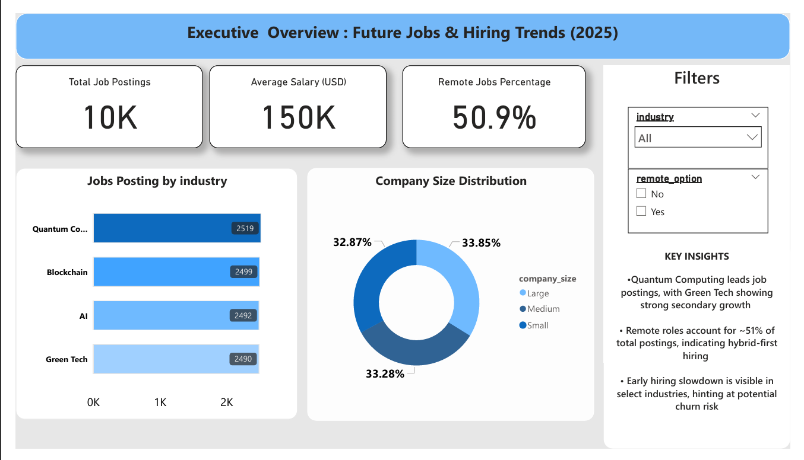
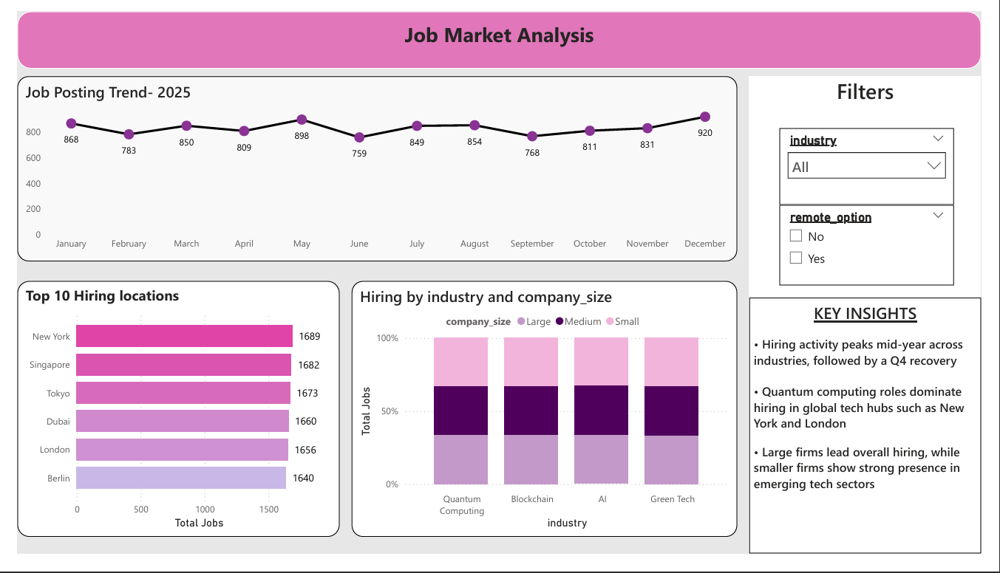

# 📊 Future Jobs, Skills Demand & Hiring Churn Analysis (2025)

### *EDA + Hiring Churn Analysis*

## 📌 Project Overview

The job market in 2025 is being reshaped by rapid technological advancements, remote work adoption, and shifting skill requirements.
This project analyzes *future job demand, skill trends, salary patterns, and hiring churn* using a *synthetic dataset* modeled on high-growth industries.

The goal of this project is to demonstrate *end-to-end data analysis skills* — from SQL-based exploration to *interactive Power BI dashboards* — while answering real-world business questions relevant to workforce planning and talent strategy.

> ⚠️ **Note:** The dataset used in this project is **synthetic**, sourced from Kaggle, and created to simulate realistic job market patterns.
> No real company or job posting data is used.
> Dataset : https://www.kaggle.com/datasets/ahsanneural/future-jobs-and-skills-demand-2025
---

## 🗂 Dataset Description

* **Total records:** 10,000 job postings
* **Industries covered:**

  * Artificial Intelligence
  * Blockchain
  * Green Technology
  * Quantum Computing
* **Time period:** January–December 2025

### Key Columns

* `job_title`
* `industry`
* `location`
* `salary_usd`
* `skills_required`
* `remote_option`
* `company_size`
* `posting_date`
* `hiring_entity_id` *(synthetically derived)*

---

## 🎯 Key Business Metrics & Insights

### 1️⃣ Job Market Overview

#### 🔹 Percentage of Remote Jobs

* **50.89%** of all job postings offer remote work
  📌 *Insight:* Remote work is nearly evenly split with on-site roles, indicating hybrid hiring dominance in 2025.

---

#### 🔹 Top Job Locations

Top hiring cities by number of postings:

* New York (1,689)
* Singapore (1,682)
* Tokyo (1,673)
* Dubai (1,660)
* London (1,656)

📌 *Insight:* Hiring demand is globally distributed, with strong representation from North America, Asia, and the Middle East.

---

### 2️⃣ Salary & Compensation Analysis

#### 🔹 Salary Distribution by Industry

| Industry          | Avg Salary (USD) |
| ----------------- | ---------------- |
| AI                | 150,672          |
| Quantum Computing | 151,131          |
| Blockchain        | 149,384          |
| Green Tech        | 149,330          |

📌 *Insight:* All four emerging industries offer **high and competitive compensation**, with Quantum Computing and AI slightly leading.

---

#### 🔹 Top 10 Highest Paying Job Roles

Some of the highest-paying roles include:

* Quantum Software Developer
* ML Researcher
* Sustainability Analyst
* Data Scientist
* Smart Contract Engineer

📌 *Insight:* Advanced research-oriented and deep-tech roles command the highest salaries.

---

### 3️⃣ Skills Demand Analysis

#### 🔹 Top 15 Most In-Demand Skills

Most frequently required skills:

* Energy Modeling
* Climate Data Analysis
* Quantum Algorithms
* TensorFlow
* Ethereum
* Qiskit
* Solidity
* Python

📌 *Insight:*

* Sustainability skills dominate Green Tech
* AI roles emphasize ML frameworks
* Blockchain roles heavily depend on Ethereum & Solidity
* Quantum roles demand specialized toolkits

---

#### 🔹 Skills Demand by Industry

* **AI:** TensorFlow, Python, PyTorch
* **Blockchain:** Ethereum, Solidity, Rust
* **Green Tech:** Energy Modeling, Climate Data Analysis
* **Quantum Computing:** Quantum Algorithms, Qiskit, Linear Algebra

📌 *Insight:* Skill specialization is highly industry-specific with minimal overlap, indicating targeted learning paths.

---

### 4️⃣ Hiring Churn Analysis *(Proxy Churn Model)*

> Since direct customer activity data is unavailable, **churn is modeled using hiring inactivity**, a common approach in B2B marketplaces and talent platforms.

#### 🔹 Hiring Churn Rate

* **15.30%** of hiring entities stopped posting jobs in the last 60 days of 2025.

📌 *Insight:* While most employers remain active, a noticeable portion exits the hiring market toward year-end.

---

#### 🔹 Churned Hiring Entities by Company Size

| Company Size | Churned Entities |
| ------------ | ---------------- |
| Small        | 151              |
| Medium       | 153              |
| Large        | 151              |

📌 *Insight:* Churn is evenly distributed across company sizes, suggesting **market-wide hiring slowdown rather than size-specific risk**.

---

### 5️⃣ Skill Demand Retention (Q1 vs Q4)

#### 🔹 Skill Retention Percentage Highlights

* Most skills retain **94%–110%** of demand from Q1 to Q4
* Skills like **Qiskit, PyTorch, Quantum Algorithms** show growth above 100%

📌 *Insight:* Advanced and future-focused skills show **increasing demand**, indicating low skill churn.

---

### 6️⃣ Remote Job Trend Analysis (H1 vs H2)

| Industry          | H1 Remote | H2 Remote |
| ----------------- | --------- | --------- |
| AI                | 623       | 628       |
| Blockchain        | 645       | 638       |
| Green Tech        | 621       | 652       |
| Quantum Computing | 636       | 646       |

📌 *Insight:*

* Remote hiring remains stable overall
* Green Tech and Quantum Computing show **remote job growth**, while Blockchain shows slight decline.

---

## 🛠 Tools & Technologies Used

* **SQL (MySQL)** – Data cleaning, EDA, KPI computation
* **Power BI** – Dashboarding & visualization *(optional extension)*
* **GitHub** – Version control & project documentation

---
## 📊 Power BI Dashboard Structure

### 📄 Page 1: Executive Overview

* Total Job Postings
* Average Salary
* % Remote Jobs
* Hiring Churn %
* Jobs by Industry
* Company Size Distribution

### 📄 Page 2: Job Market Analysis

* Monthly hiring trends
* Top hiring locations
* Industry vs company size hiring patterns

### 📄 Page 3: Skills Demand Analysis

* Top 15 in-demand skills
* Skill demand by industry
* Skills required for remote jobs

### 📄 Page 4: Salary & Remote Insights

* Average salary by industry
* Highest-paying job roles
* Salary comparison: Remote vs Onsite

### 📄 Page 5: Churn Analysis

* Active vs churned hiring entities
* Hiring churn by industry
* Hiring churn by company size
* Skills showing demand attrition

---

## 📈 Dashboard Pages

### 1️⃣ Executive Overview

### 2️⃣ Job Market Analysis

### 3️⃣ Skills Demand Analysis

### 4️⃣ Salary & Remote Insights

### 5️⃣ Hiring Churn Analysis

---

##  Repository Structure

📦 Future-Jobs-Churn-Analysis
 ┣ 📄 README.md
 ┣ 📄 future_jobs_eda_and_churn_analysis.sql
 ┣ 📄 future_jobs_dataset.csv
 ┣ 📊 PowerBI_Dashboard.pbix

---

## 📌 Key Takeaways

* Emerging tech industries offer **high salaries and global opportunities**
* Skills demand is **highly specialized by industry**
* Hiring churn exists but remains **moderate (15.3%)**
* Remote work continues to be a **core hiring strategy**
* Advanced skills show **strong long-term retention**

---

## ⚠️ Disclaimer

This project uses a **synthetic dataset** sourced from Kaggle, created for educational and analytical purposes only.
All insights are **simulated** and do not represent real companies or hiring behavior.

---

